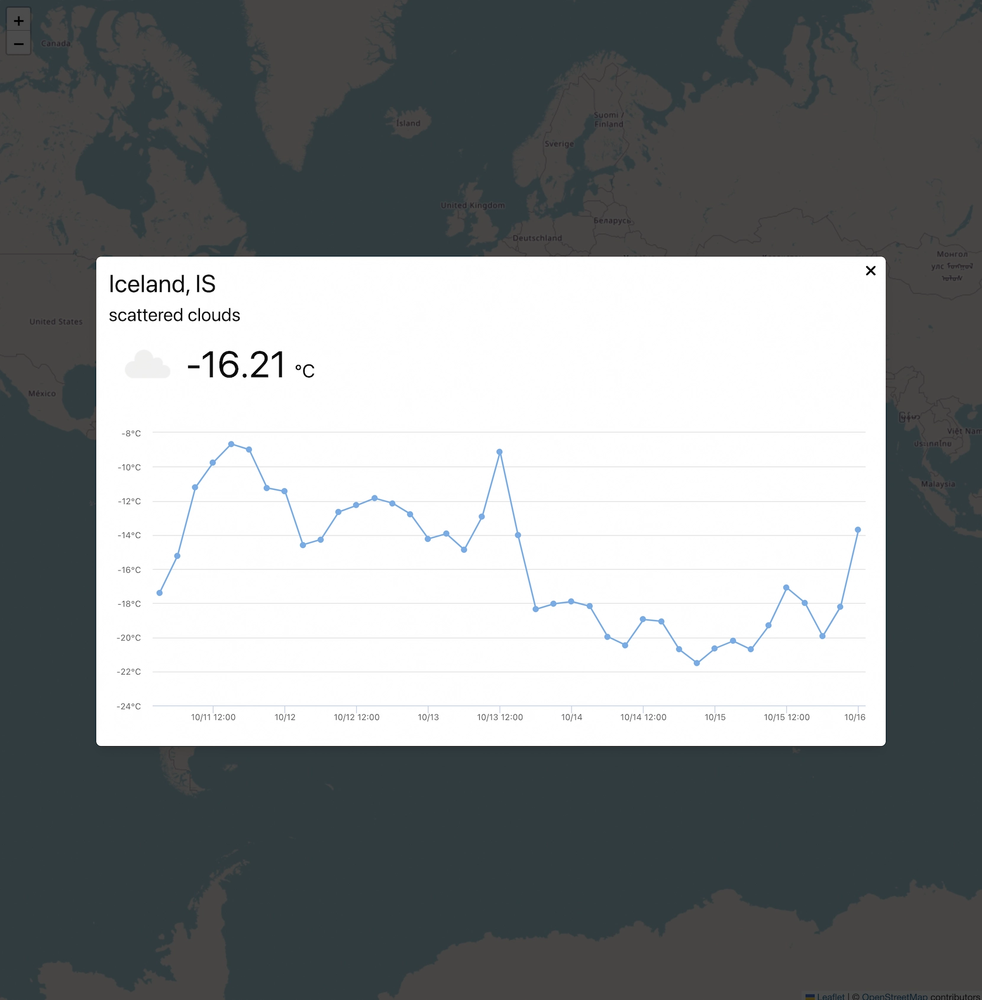

	
	<h1 align="center">weather</h1>
	

		a web app to check the weather
	

	
<a href="https://weather-hokuto-kato.vercel.app/">View Demo</a>

	

	

## Built With

-   Vue.js
-   Pinia
-   Open Weather API
-   Highcharts
-   Vercel
